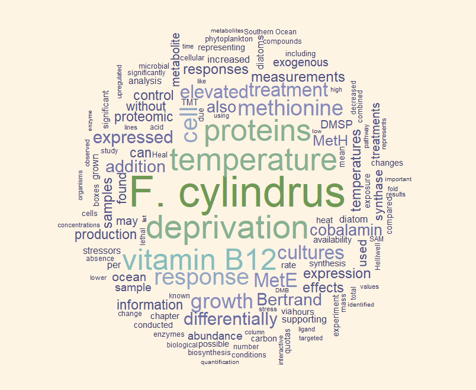

# Thesis Word Cloud
Quick little repo for creating a word cloud from my thesis :-)

Here I use the packages `wordcloud`, `tm`, and `MetBrewer` to make a visually appealing representation of the frequency of words used in my thesis. Here's the result!

